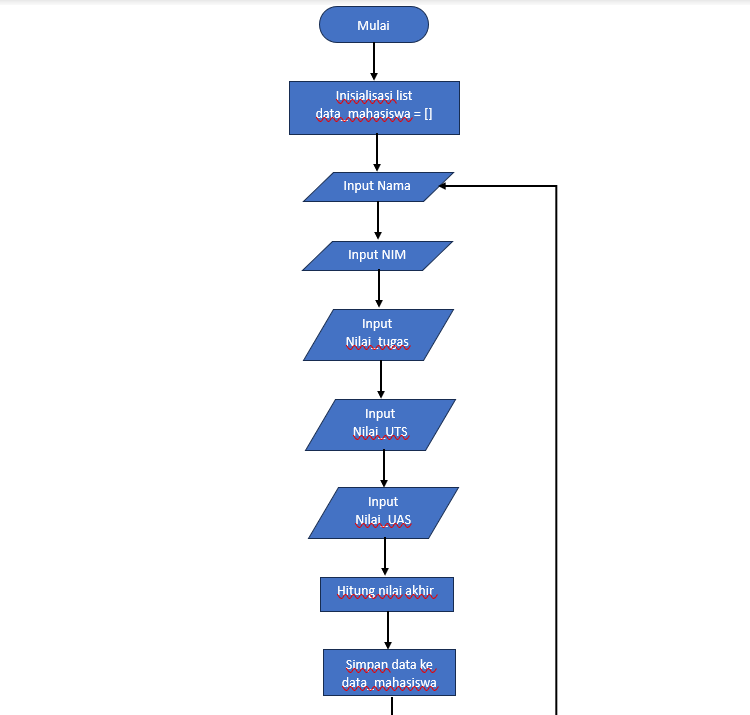

# praktikum_4

Nama: Bagus Sanjaya

NIM: 312410505

Kelas: TI.24.A.5

## Ini adalah penjelasan dari program yang saya buat

Fungsi ini menghitung nilai akhir berdasarkan nilai tugas, UTS, dan UAS dengan bobot masing-masing:

- Tugas: 30%

- UTS: 35%

- UAS: 35%

STRUKTUR UTAMA PROGRAM

Program ini mengumpulkan data mahasiswa, menghitung nilai akhir mereka, dan menampilkan hasil dalam bentuk tabel. Berikut adalah langkah-langkah utamanya:

1. Inisialisasi list data_mahasiswa:

List kosong ini akan menyimpan data semua mahasiswa.

2. Pengumpulan data dengan while true: loop ini akan terus meminta iput dari pengguna hingga pengguna memilih untuk berhenti.

- Input data: Mengambil input dari pengguna untuk nama, nim, tugas, uts, dan uas.

- Menghitung nilai akhir: Menggunakan fungsi hitung_nilai_akhir untuk menghitung nilai akhir.

- Menyimpan data: Menyimpan semua data ke dalam dictionary dan menambahkannya ke list data_mahasiswa.

- Kontrol loop: Menanyakan pengguna apakah ingin menambahkan data lagi. Jika pengguna menjawab 't', loop akan berhenti.

3. Mencetak tabel data mahasiswa:

- Header tabel:

Mencetak header tabel dengan format yang diatur.

- Isi tabel:

Loop ini akan mencetak setiap data mahasiswa dalam bentuk tabel. enumerate digunakan untuk mendapatkan indeks mulai dari 1. 

- Footer tabel:

Mencetak garis penutup tabel.

## Ini adalah Output dari program yang saya buat

## Ini adalah penjelasan dari flowchart yang saya buat

1. 

Memulai flowchart menggunakan simbol oval.

2. 

Inisialisasi list data_mahasiswa tersebut kosong.

3. 

Memasukan Nama, NIM, Nilai_tugas, Nilai_UTS, Nilai_UAS.

4. 

Menghitung nilai akhir dengan program yang tadi sudah saya buat.

hitung_nilai_akhir(tugas, uts, uas):

(tugas * 0.3) + (uts * 0.35) + (uas * 0.35)

5. 

Simpan semua data mahasiswa tersebut ke data_mahasiswa, yang dimana data mahasiswa tersebut mencangkup Nama, NIM, Nilai_tugas, Nilai_UTS, Nilai_UAS, dan Nilai_akhir.

6. 

Apakah pengguna ingin menambah data lagi?

- Jika y, maka program akan kembali ke no3.

- Jika t, maka program akan melanjutkan ke langkah berikutnya.

7. 

Mencetak header tabel yang sudah saya buat pada program sebelumnya.

8. 

Menampilkan data mahasiswa yang telah diinputkan berbentuk tabel.

9. 

Mencetak footer tabel yang sudah saya buat pada program sebelumnya.

10. 

Program selesai ditutup dengan simbol oval.

## Dan ini adalah flowchartnya

